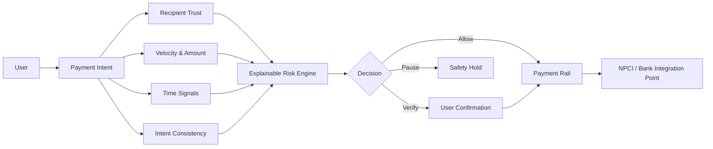

```mermaid
flowchart LR
A[User] --> B[Payment Intent]
B --> C[Recipient Trust]
B --> D[Velocity & Amount]
B --> E[Time Signals]
B --> F[Intent Consistency]
C --> G[Explainable Risk Engine]
D --> G
E --> G
F --> G
G --> H{Decision}
H -->|Allow| I[Payment Rail]
H -->|Verify| J[User Confirmation]
H -->|Pause| K[Safety Hold]
J --> I
I --> L[NPCI / Bank Integration Point]
```
